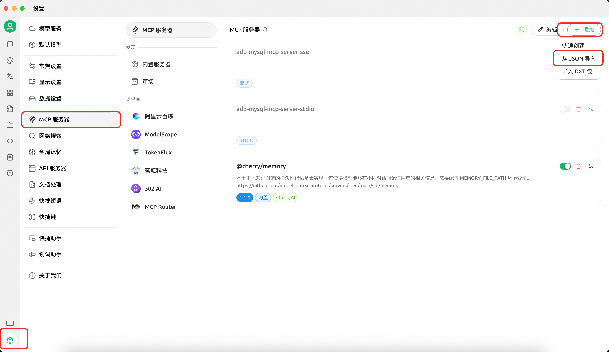

# AnalyticDB for MySQL MCP Server

English | [中文](README_zh.md)

AnalyticDB for MySQL MCP Server is a universal interface between AI Agents and [AnalyticDB MySQL](https://www.alibabacloud.com/zh/product/analyticdb-for-mysql). It provides two categories of capabilities:

- **OpenAPI Tools** (`openapi` group): Manage clusters, whitelists, accounts, networking, monitoring, diagnostics, and audit logs via Alibaba Cloud OpenAPI.
- **SQL Tools & Resources** (`sql` group): Connect directly to ADB MySQL clusters to execute SQL, view execution plans, and browse database metadata.

Read-only tools are annotated with `ToolAnnotations(readOnlyHint=True)` per the MCP protocol, allowing clients to distinguish them from mutating operations.

## 一、Prerequisites

- Python >= 3.13
- [uv](https://docs.astral.sh/uv/getting-started/installation/) (recommended package manager and runner)
- Alibaba Cloud AccessKey (required for OpenAPI tools)
- Optional: ADB MySQL connection credentials (for SQL tools in direct-connection mode)

## 二、Quick Start

### 2.1 Using [cherry-studio](https://github.com/CherryHQ/cherry-studio) (Recommended)

1. Download and install [cherry-studio](https://github.com/CherryHQ/cherry-studio)
2. Follow the [documentation](https://docs.cherry-ai.com/cherry-studio/download) to install `uv`, which is required for the MCP environment
3. Configure and use ADB MySQL MCP according to the [documentation](https://docs.cherry-ai.com/advanced-basic/mcp/install). You can quickly import the configuration using the JSON below.



**Configuration A — SQL tools only (execute queries, view plans, browse metadata):**

```json
{
  "mcpServers": {
    "adb-mysql-mcp-server": {
      "name": "adb-mysql-mcp-server",
      "type": "stdio",
      "isActive": true,
      "command": "uv",
      "args": [
        "--directory",
        "/path/to/alibabacloud-adb-mysql-mcp-server",
        "run",
        "adb-mysql-mcp-server"
      ],
      "env": {
        "ADB_MYSQL_HOST": "your_adb_mysql_host",
        "ADB_MYSQL_PORT": "3306",
        "ADB_MYSQL_USER": "your_username",
        "ADB_MYSQL_PASSWORD": "your_password",
        "ADB_MYSQL_DATABASE": "your_database"
      }
    }
  }
}
```

**Configuration B — OpenAPI tools (cluster management, diagnostics, monitoring):**

> **Note**: Please set `ALIBABA_CLOUD_ACCESS_KEY_ID` and `ALIBABA_CLOUD_ACCESS_KEY_SECRET` to your Alibaba Cloud AccessKey credentials.

```json
{
  "mcpServers": {
    "adb-mysql-mcp-server": {
      "name": "adb-mysql-mcp-server",
      "type": "stdio",
      "isActive": true,
      "command": "uv",
      "args": [
        "--directory",
        "/path/to/alibabacloud-adb-mysql-mcp-server",
        "run",
        "adb-mysql-mcp-server"
      ],
      "env": {
        "ALIBABA_CLOUD_ACCESS_KEY_ID": "your_access_key_id",
        "ALIBABA_CLOUD_ACCESS_KEY_SECRET": "your_access_key_secret"
      }
    }
  }
}
```

> You can combine both configurations by setting all environment variables together. When AK/SK is not configured, OpenAPI tools are automatically disabled — only SQL tools remain active.

### 2.2 Using Claude Code

Download from GitHub and sync dependencies:

```shell
git clone https://github.com/aliyun/alibabacloud-adb-mysql-mcp-server
cd alibabacloud-adb-mysql-mcp-server
uv sync
```

Add the following configuration to the Claude Code MCP config file (project-level: `.mcp.json` in the project root, or user-level: `~/.claude/settings.json`):

**stdio transport:**

```json5
{
  "mcpServers": {
    "adb-mysql-mcp-server": {
      "command": "uv",
      "args": [
        "--directory",
        "/path/to/alibabacloud-adb-mysql-mcp-server",
        "run",
        "adb-mysql-mcp-server"
      ],
      "env": {
        "ALIBABA_CLOUD_ACCESS_KEY_ID": "your_access_key_id",
        "ALIBABA_CLOUD_ACCESS_KEY_SECRET": "your_access_key_secret",
        "ALIBABA_CLOUD_SECURITY_TOKEN": "",
        // Uncomment the following lines to enable SQL tools for direct database connection:
        // "ADB_MYSQL_HOST": "your_adb_mysql_host",
        // "ADB_MYSQL_PORT": "3306",
        // "ADB_MYSQL_USER": "your_username",
        // "ADB_MYSQL_PASSWORD": "your_password",
        // "ADB_MYSQL_DATABASE": "your_database"
      }
    }
  }
}
```

**SSE transport** — start the server first, then configure the client:

```bash
export ALIBABA_CLOUD_ACCESS_KEY_ID="your_access_key_id"
export ALIBABA_CLOUD_ACCESS_KEY_SECRET="your_access_key_secret"
# Uncomment the following lines to enable SQL tools for direct database connection:
# export ADB_MYSQL_HOST="your_adb_mysql_host"
# export ADB_MYSQL_PORT="3306"
# export ADB_MYSQL_USER="your_username"
# export ADB_MYSQL_PASSWORD="your_password"
# export ADB_MYSQL_DATABASE="your_database"
export SERVER_TRANSPORT=sse
export SERVER_PORT=8000

uv --directory /path/to/alibabacloud-adb-mysql-mcp-server run adb-mysql-mcp-server
```

```json
{
  "mcpServers": {
    "adb-mysql-mcp-server": {
      "url": "http://localhost:8000/sse"
    }
  }
}
```

**Streamable HTTP transport** — start the server first, then configure the client:

```bash
export ALIBABA_CLOUD_ACCESS_KEY_ID="your_access_key_id"
export ALIBABA_CLOUD_ACCESS_KEY_SECRET="your_access_key_secret"
# Uncomment the following lines to enable SQL tools for direct database connection:
# export ADB_MYSQL_HOST="your_adb_mysql_host"
# export ADB_MYSQL_PORT="3306"
# export ADB_MYSQL_USER="your_username"
# export ADB_MYSQL_PASSWORD="your_password"
# export ADB_MYSQL_DATABASE="your_database"
export SERVER_TRANSPORT=streamable_http
export SERVER_PORT=8000

uv --directory /path/to/alibabacloud-adb-mysql-mcp-server run adb-mysql-mcp-server
```

```json
{
  "mcpServers": {
    "adb-mysql-mcp-server": {
      "url": "http://localhost:8000/mcp"
    }
  }
}
```

> **Note**: When `ADB_MYSQL_USER` and `ADB_MYSQL_PASSWORD` are not configured but AK/SK is available, a temporary database account is automatically created via OpenAPI for SQL execution and cleaned up afterward.

### 2.3 Using Cline

Set environment variables and run the MCP server:

```bash
export ALIBABA_CLOUD_ACCESS_KEY_ID="your_access_key_id"
export ALIBABA_CLOUD_ACCESS_KEY_SECRET="your_access_key_secret"
export SERVER_TRANSPORT=sse
export SERVER_PORT=8000

uv --directory /path/to/alibabacloud-adb-mysql-mcp-server run adb-mysql-mcp-server
```

Then configure the Cline remote server:

```
remote_server = "http://127.0.0.1:8000/sse"
```

## 三、Environment Variables

| Variable | Required | Description |
| --- | --- | --- |
| `ALIBABA_CLOUD_ACCESS_KEY_ID` | Yes (OpenAPI tools) | Alibaba Cloud AccessKey ID |
| `ALIBABA_CLOUD_ACCESS_KEY_SECRET` | Yes (OpenAPI tools) | Alibaba Cloud AccessKey Secret |
| `ALIBABA_CLOUD_SECURITY_TOKEN` | No | STS temporary security token |
| `ADB_MYSQL_HOST` | No | Database host (direct-connection mode) |
| `ADB_MYSQL_PORT` | No | Database port, default 3306 (direct-connection mode) |
| `ADB_MYSQL_USER` | No | Database username (direct-connection mode) |
| `ADB_MYSQL_PASSWORD` | No | Database password (direct-connection mode) |
| `ADB_MYSQL_DATABASE` | No | Default database name (direct-connection mode) |
| `ADB_MYSQL_CONNECT_TIMEOUT` | No | Database connection timeout in seconds, default 2 |
| `ADB_API_CONNECT_TIMEOUT` | No | OpenAPI connection timeout in milliseconds, default 10000 (10s) |
| `ADB_API_READ_TIMEOUT` | No | OpenAPI read timeout in milliseconds, default 300000 (5min) |
| `SERVER_TRANSPORT` | No | Transport protocol: `stdio` (default), `sse`, `streamable_http` |
| `SERVER_PORT` | No | SSE/HTTP server port, default 8000 |

## 四、Tool List

### 4.1 Cluster Management (group: `openapi`)

| Tool | Description |
| --- | --- |
| `describe_db_clusters` | List ADB MySQL clusters in a region |
| `describe_db_cluster_attribute` | Get detailed cluster attributes |
| `describe_cluster_access_whitelist` | Get cluster IP whitelist |
| `modify_cluster_access_whitelist` | Modify cluster IP whitelist |
| `describe_accounts` | List database accounts in a cluster |
| `describe_cluster_net_info` | Get cluster network connection info |
| `get_current_time` | Get current server time |

### 4.2 Diagnostics & Monitoring (group: `openapi`)

| Tool | Description |
| --- | --- |
| `describe_db_cluster_performance` | Query cluster performance metrics (CPU, memory, QPS, etc.) |
| `describe_db_cluster_health_status` | Query cluster health status |
| `describe_diagnosis_records` | Query SQL diagnosis summary records |
| `describe_diagnosis_sql_info` | Get SQL execution details (plan, runtime info) |
| `describe_bad_sql_detection` | Detect bad SQL impacting cluster stability |
| `describe_sql_patterns` | Query SQL pattern list |
| `describe_table_statistics` | Query table-level statistics |

### 4.3 Administration & Audit (group: `openapi`)

| Tool | Description |
| --- | --- |
| `create_account` | Create a database account |
| `modify_db_cluster_description` | Modify cluster description |
| `describe_db_cluster_space_summary` | Get cluster storage space summary |
| `describe_audit_log_records` | Query SQL audit log records |

### 4.4 Advanced Diagnostics (group: `openapi`)

| Tool | Description |
| --- | --- |
| `describe_executor_detection` | Compute node diagnostics |
| `describe_worker_detection` | Storage node diagnostics |
| `describe_controller_detection` | Access node diagnostics |
| `describe_available_advices` | Get optimization advices |
| `kill_process` | Kill a running query process |
| `describe_db_resource_group` | Get resource group configuration |
| `describe_excessive_primary_keys` | Detect tables with excessive primary keys |
| `describe_oversize_non_partition_table_infos` | Detect oversized non-partition tables |
| `describe_table_partition_diagnose` | Diagnose table partitioning issues |
| `describe_inclined_tables` | Detect data-skewed tables |

### 4.5 SQL Tools (group: `sql`)

| Tool | Description |
| --- | --- |
| `execute_sql` | Execute SQL on an ADB MySQL cluster |
| `get_query_plan` | Get EXPLAIN execution plan |
| `get_execution_plan` | Get EXPLAIN ANALYZE actual execution plan |

### 4.6 MCP Resources (group: `sql`)

| Resource URI | Description |
| --- | --- |
| `adbmysql:///databases` | List all databases |
| `adbmysql:///{database}/tables` | List all tables in a database |
| `adbmysql:///{database}/{table}/ddl` | Get table DDL |
| `adbmysql:///config/{key}/value` | Get a config key value |

## 五、Local Development

```shell
git clone https://github.com/aliyun/alibabacloud-adb-mysql-mcp-server
cd alibabacloud-adb-mysql-mcp-server
uv sync
```

Run tests:

```shell
uv run python -m pytest test/ -v
```

Debug with MCP Inspector:

```shell
npx @modelcontextprotocol/inspector \
  -e ALIBABA_CLOUD_ACCESS_KEY_ID=your_ak \
  -e ALIBABA_CLOUD_ACCESS_KEY_SECRET=your_sk \
  uv --directory /path/to/alibabacloud-adb-mysql-mcp-server run adb-mysql-mcp-server
```
## 六、SKILL

In addition to the MCP server above, this project also provides an **independent** SKILL under the `skill/` directory. The Skill can be deployed directly to Claude Code without relying on this MCP server (it calls ADB MySQL OpenAPI through `call_adb_api.py` in the SKILL directory).

The Skill covers cluster information queries, performance monitoring, slow query diagnosis, SQL Pattern analysis, and SQL execution, with built-in guided diagnostic workflows for common scenarios.

For setup and usage details, see [skill/skill_readme.md](skill/skill_readme.md).

> **Note**: The evolution of this Skill will be aligned with our next-generation Agent in the future. Stay tuned.


## License

Apache License 2.0
