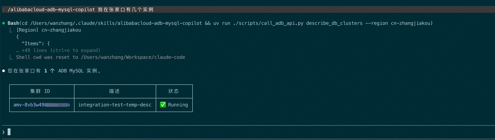
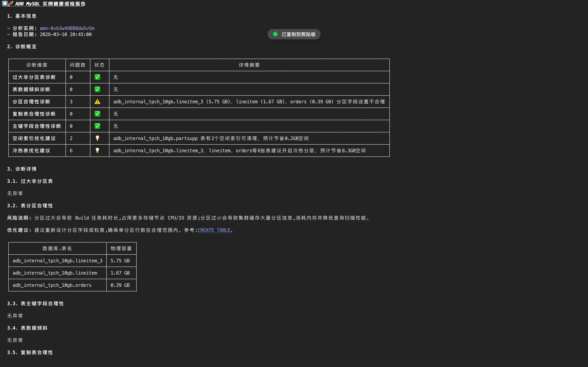
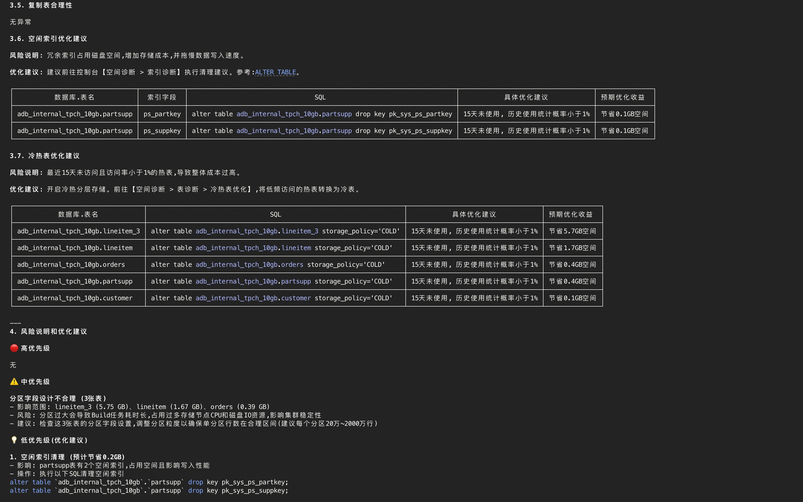
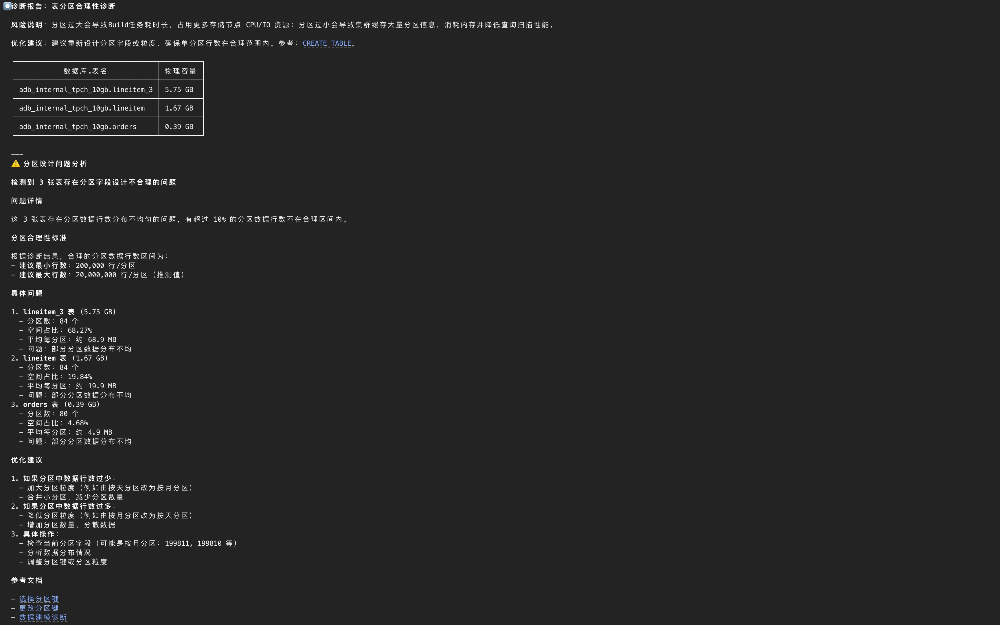
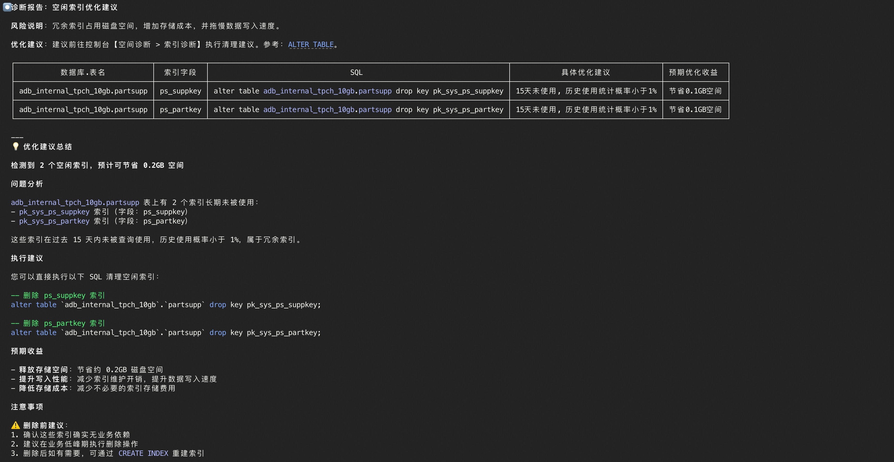
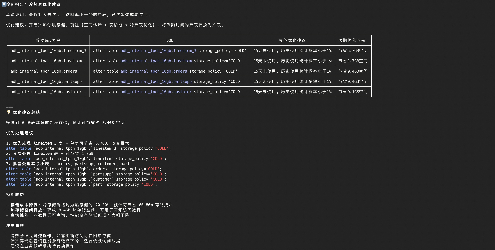

# ADB MySQL Copilot - Claude Code Skill

A Claude Code skill for Alibaba Cloud [AnalyticDB for MySQL (ADB MySQL)](https://www.alibabacloud.com/zh/product/analyticdb-for-mysql). Enables AI-assisted cluster management, performance monitoring, slow query diagnosis, and SQL execution directly within Claude conversations.

## 一、Features

- **Cluster Management**: List clusters, view detailed attributes, storage space summary, accounts, and network info
- **Performance Monitoring**: Query CPU, memory, QPS, RT, connections, disk usage, and other metrics
- **Slow Query Diagnosis**: Detect BadSQL, analyze SQL Patterns, locate slow query root causes with guided diagnostic workflows
- **Running SQL Analysis**: Inspect currently executing queries, identify resource-heavy operations
- **Table Analysis**: Table statistics, optimization advices, excessive primary keys, oversized non-partition tables, partition diagnosis, data skew detection
- **SQL Execution**: Execute diagnostic SQL directly against the database (requires database connection credentials)
- **Diagnostic Scenarios**: Built-in guided workflows for common scenarios (slow query triage, cluster inspection, SQL-based diagnostics)
- **Zero Installation**: Uses `uv run` with inline script dependencies — no `pip install` needed

## 二、Requirements

- Python 3.10+
- [uv](https://docs.astral.sh/uv/) (recommended) or pip
- Alibaba Cloud Access Key with ADB MySQL permissions

## 三、Quick Start

### 3.1 Clone the repository

```bash
git clone https://github.com/aliyun/alibabacloud-adb-mysql-mcp-server
cd alibabacloud-adb-mysql-mcp-server/skill
```

### 3.2 Install uv

```bash
curl -LsSf https://astral.sh/uv/install.sh | sh
```

### 3.3 Set environment variables

**macOS / Linux:**

```bash
export ALIBABA_CLOUD_ACCESS_KEY_ID="your-access-key-id"
export ALIBABA_CLOUD_ACCESS_KEY_SECRET="your-access-key-secret"
# Optional: STS token for temporary credentials
# export ALIBABA_CLOUD_SECURITY_TOKEN="your-sts-token"
# Optional: Direct database connection (for execute_sql)
# export ADB_MYSQL_HOST="your_host"
# export ADB_MYSQL_PORT="3306"
# export ADB_MYSQL_USER="your_username"
# export ADB_MYSQL_PASSWORD="your_password"
# export ADB_MYSQL_DATABASE="your_database"
```

**Permanent configuration (recommended):**

Add the above to your shell config file (`~/.bashrc`, `~/.zshrc`, etc.).

### 3.4 Deploy to Claude Code

Copy the skill directory to the Claude Code skills folder:

```bash
# macOS / Linux
mkdir -p ~/.claude/skills/
cp -r alibabacloud-adb-mysql-copilot ~/.claude/skills/
```

Or create a symbolic link (recommended for development):

```bash
mkdir -p ~/.claude/skills/
ln -s "$(pwd)/alibabacloud-adb-mysql-copilot" ~/.claude/skills/alibabacloud-adb-mysql-copilot
```

### 3.5 Verify installation

Launch Claude Code and invoke the skill:

```bash
claude
```

```bash
/alibabacloud-adb-mysql-copilot How many clusters do I have in cn-zhangjiakou?
```

## 四、Usage Examples

After mounting the skill, you can describe your intent directly in a Claude Code conversation. Claude will invoke the corresponding diagnostics and return the results.

### 4.1 Cluster lookup

Find the list of clusters in a specified region.
```text
You: /alibabacloud-adb-mysql-copilot Which ADB MySQL clusters are in the cn-hangzhou region?
Claude: [Invokes ADB MySQL Copilot and returns the result]
```



### 4.2 Slow query diagnosis

Run a **slow query diagnosis** on a specified cluster for a given time range.
```text
You: /alibabacloud-adb-mysql-copilot Run a slow query diagnosis on cluster amv-xxx in cn-zhangjiakou for the last 2 hours.
Claude: [Invokes slow query diagnosis, returns BadSQL list and optimization suggestions]
```


### 4.3 Cluster space diagnosis

Run a **full space inspection** on a specified cluster (executes in parallel: oversized non-partition tables, partition validity, primary key validity, table skew, dimension table validity, idle indexes, and hot/cold tiering — 7 checks total), then produces a consolidated health report.

```text
You: /alibabacloud-adb-mysql-copilot Run a space diagnosis on cluster amv-xxx in cn-zhangjiakou.
Claude: [Invokes space diagnosis, runs multiple checks in parallel, and returns a health report]
```




### 4.4 Table skew diagnosis

Detect fact tables with data skew (which can cause resource imbalance and long-tail queries).

```text
You: /alibabacloud-adb-mysql-copilot Does cluster amv-xxx have any table data skew? Check the fact table skew.
Claude: [Invokes table skew diagnosis, returns skewed fact tables and skew details]
```

### 4.5 Partition validity diagnosis

Detect tables with poorly designed partition keys (partitions too large or too small can impact Build and query performance).

```text
You: /alibabacloud-adb-mysql-copilot Run a partition validity diagnosis on amv-xxx to check for poorly partitioned tables.
Claude: [Invokes partition diagnosis, returns tables with invalid partitions and their physical size]
```



### 4.6 Oversized non-partition table diagnosis

Detect tables that are not partitioned yet have grown excessively large (prone to full-table Build, disk and performance issues).

```text
You: /alibabacloud-adb-mysql-copilot Check if amv-xxx has any oversized non-partition tables.
Claude: [Invokes oversized non-partition table diagnosis, returns table names, physical size and row counts]
```

### 4.7 Dimension table validity diagnosis

Detect dimension (broadcast) tables with excessive row counts (broadcast writes amplify write pressure for large tables).

```text
You: /alibabacloud-adb-mysql-copilot Run a dimension table validity diagnosis on amv-xxx.
Claude: [Invokes dimension table diagnosis, returns invalid dimension tables with size and row counts]
```

### 4.8 Idle index optimization advices

View idle or redundant indexes that can be dropped or optimized.

```text
You: /alibabacloud-adb-mysql-copilot Does amv-xxx have any idle index optimization advices? Looking to save storage and write cost.
Claude: [Invokes idle index advice, returns optimizable indexes with suggestions and expected savings]
```



### 4.9 Hot/cold tiering optimization advices

View tables suitable for hot-to-cold tiering to reduce costs.

```text
You: /alibabacloud-adb-mysql-copilot What hot/cold tiering advices are there for amv-xxx? Which tables can be moved to cold storage?
Claude: [Invokes hot/cold tiering advice, returns tables eligible for cold storage with suggestions and expected savings]
```



### 4.10 Execute SQL on a specific cluster

To execute SQL against a specific cluster, configure these environment variables: `ADB_MYSQL_HOST/ADB_MYSQL_PORT/ADB_MYSQL_USER/ADB_MYSQL_PASSWORD/ADB_MYSQL_DATABASE`.

```text
You: /alibabacloud-adb-mysql-copilot What is the current hot/cold table conversion progress on amv-xxx?
Claude: [Queries system tables for hot/cold table conversion progress]

You: /alibabacloud-adb-mysql-copilot Show the common config parameter values for amv-xxx.
Claude: [Queries system tables for common config parameter values]
```


## 五、Troubleshooting

### 5.1 Missing dependencies

If you see `ImportError`, install dependencies manually:

```bash
pip install alibabacloud-adb20211201 alibabacloud-tea-openapi alibabacloud-tea-util pymysql
```

### 5.2 Credentials error

Ensure `ALIBABA_CLOUD_ACCESS_KEY_ID` and `ALIBABA_CLOUD_ACCESS_KEY_SECRET` are set correctly:

```bash
echo $ALIBABA_CLOUD_ACCESS_KEY_ID   # Should not be empty
echo $ALIBABA_CLOUD_ACCESS_KEY_SECRET  # Should not be empty
```

### 5.3 Skill not recognized by Claude Code

1. Verify the skill is in `~/.claude/skills/alibabacloud-adb-mysql-copilot/`
2. Ensure `SKILL.md` exists in the skill root directory
3. Restart Claude Code
